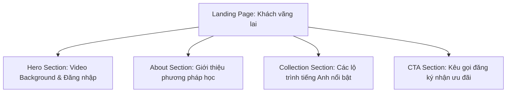
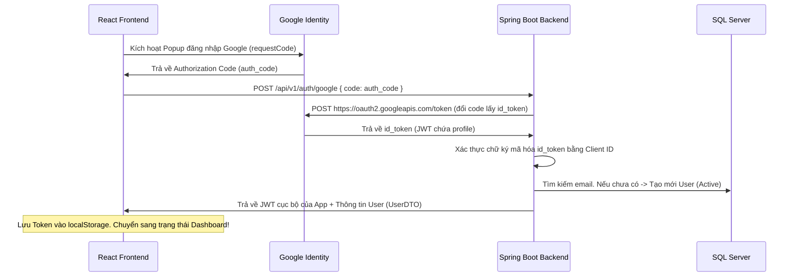

# 🎨 Hệ thống Thiết kế & Kiến trúc Giao diện (Landing Page & Dashboard)

Tài liệu này định hình phong cách thiết kế mỹ thuật cao (Premium Aesthetic), bố cục giao diện người dùng và sơ đồ luồng dữ liệu cho trang web tự học tiếng Anh **English.Learn**.

---

## 1. Hệ thống thiết kế (Design System)

Dự án áp dụng phong cách thiết kế **Cyber-Future Glassmorphism & Acid Green** hiện đại, tạo chiều sâu thị giác và cảm giác premium ấn tượng.

### 🎨 Bảng màu (Color Palette)
*   **Deep Background (Màu nền chính)**: `#010828` (Xanh hải quân siêu tối - tạo chiều sâu không gian).
*   **Acid Accent (Màu nhấn)**: `#6FFF00` (Xanh lá chuối/neon phản quang - bắt mắt, thúc đẩy năng lượng).
*   **Ice Text (Màu chữ chính)**: `#EFF4FF` (Trắng băng thanh khiết - dễ đọc, tương phản cao trên nền tối).
*   **Secondary Text (Chữ phụ)**: `#EFF4FF` với độ mờ (opacity) `30%` - `70%`.
*   **Glass Border (Viền kính)**: `rgba(255, 255, 255, 0.1)` hoặc `#6FFF00` với độ mờ thấp (`10% - 20%`).

### ✍️ Phông chữ (Typography)
*   **Font Tiêu đề chính (Header/Display)**: `Grotesk` (Mạnh mẽ, viết hoa, mang tính kỹ thuật số và thể thao).
*   **Font Viết tay nghệ thuật (Accent)**: `Condiment` (Mềm mại, bay bổng, màu neon nghiêng nhẹ để tạo điểm nhấn tương phản).
*   **Font Văn bản/Code (Monospace)**: `Courier New` / `JetBrains Mono` (Dùng cho các nhãn phân loại, ngày tháng và nút phụ).

### ✨ Hiệu ứng kính mờ (Glassmorphism)
```css
.liquid-glass {
  background: rgba(255, 255, 255, 0.03);
  backdrop-filter: blur(20px);
  -webkit-backdrop-filter: blur(20px);
  border: 1px solid rgba(255, 255, 255, 0.08);
}
```

---

## 2. Cấu trúc Landing Page (Trang khách chưa đăng nhập)

Landing page đóng vai trò phễu thu hút học viên, bao gồm các khu vực chính sau:



1.  **Hero Section**:
    *   Sử dụng video nền full-bleed tạo cảm giác điện ảnh sống động.
    *   Tiêu đề chữ lớn phi đối xứng: *"BEYOND WORDS AND ( ITS ) FAMILIAR BOUNDARIES"*.
    *   Hộp điều hướng kính mờ (`liquid-glass`) và nút Đăng nhập / Đăng ký màu Acid Green nổi bật.
2.  **About Section**:
    *   Giới thiệu phương pháp học cá nhân hóa thế hệ mới.
3.  **Collection Section**:
    *   Trưng bày các bộ từ vựng, ngữ pháp theo dạng thẻ card 3D hover phát sáng xanh lá.
4.  **CTA (Call To Action) Section**:
    *   Mời gọi học thử miễn phí và liên kết mở bảng giá khóa học (`PricingModal`).

---

## 3. Kiến trúc Trang chủ chính (Dashboard sau khi đăng nhập)

Khi người dùng thực hiện đăng nhập Google thành công, thay vì xem trang Landing Page tĩnh, họ sẽ được chuyển hướng sang một **Dashboard học tập cá nhân hóa chuyên nghiệp (Logged-in Homepage)**.

### 📐 Sơ đồ bố cục Dashboard (Layout Wireframe)
```
+-----------------------------------------------------------------------------------+
|  English.Learn                                      [Học tiếp]  [Ảnh Đại Diện v]  | (Header)
+-----------------------------------------------------------------------------------+
|  +--------------------------------------------+  +-----------------------------+  |
|  | 🎉 Chào mừng trở lại, [Tên Người Dùng]!    |  | 🔥 Thống Kê Học Tập         |  |
|  | "Hôm nay là một ngày tuyệt vời để học."     |  | - Chuỗi liên tục: 5 ngày    |  |
|  | [Học tiếp bài dang dở]                     |  | - Thời gian: 120 phút       |  |
|  +--------------------------------------------+  +-----------------------------+  |
|                                                                                   |
|  📚 KHÓA HỌC CỦA BẠN (ENROLLED COURSES)                                            |
|  +------------------------+  +------------------------+  +------------------------+  |
|  | Lộ trình Phát âm       |  | Từ vựng IELTS 7.5      |  | Ngữ pháp Căn bản       |  |
|  | Tiến trình: 65%        |  | Tiến trình: 12%        |  | Tiến trình: 90%        |  |
|  | [Học tiếp ->]          |  | [Học tiếp ->]          |  | [Học tiếp ->]          |  |
|  +------------------------+  +------------------------+  +------------------------+  |
|                                                                                   |
|  ⚡ HOẠT ĐỘNG NHANH (QUICK ACTIONS)                                                |
|  [Học Từ Vựng Hàng Ngày]   [Thi Thử Quiz nhanh]   [Tải Chứng Chỉ Đã Đạt]          |
+-----------------------------------------------------------------------------------+
```

### ✨ Các thành phần giao diện Dashboard (Components)
*   **Sleek Navbar**: Rút gọn, hiển thị số dư điểm/streak của học viên, avatar tròn có menu dropdown chứa thông tin tài khoản và nút Đăng xuất.
*   **Welcome Banner (Vibrant Gradient)**: Nền kính mờ chuyển sắc neon xanh lá nhẹ nhàng, có thông điệp tạo động lực thay đổi theo thời gian thực (Sáng/Chiều/Tối).
*   **Stats Grid**: 3 thẻ số liệu trực quan:
    1.  *Lessons Completed* (Số bài học đã xong).
    2.  *Study Time* (Thời gian học tích lũy bằng phút).
    3.  *Streak Count* (Chuỗi học tập liên tục).
*   **Enrolled Courses (Khóa học của bạn)**:
    *   Hiển thị danh sách khóa học người dùng đang học.
    *   Tích hợp thanh tiến trình (progress bar) màu xanh neon chạy mượt mà.
    *   Nút "Học tiếp" chuyển thẳng tới bài học dang dở.
*   **Quick Practice (Luyện tập nhanh)**: Khu vực học nhanh từ vựng ngẫu nhiên bằng Flashcard.

---

## 4. Sơ đồ luồng Dữ liệu & APIs xác thực



---

## 5. Kế hoạch triển khai Frontend (Next Steps)
1.  Tạo component **`Dashboard.tsx`** trong thư mục `frontend/src/pages/` với thiết kế neon-glassmorphic tuyệt đẹp.
2.  Bổ sung cơ chế chuyển đổi màn hình trong `frontend/src/App.tsx`:
    *   Nếu `user === null`: Hiển thị toàn bộ Landing Page (`Hero`, `About`, `Collection`, `CTA`).
    *   Nếu `user !== null`: Hiển thị `Dashboard` học tập cá nhân hóa kèm theo đầy đủ các chỉ số dữ liệu thật.
3.  Tích hợp các hiệu ứng chuyển cảnh mượt mà để tăng trải nghiệm cho người dùng.
