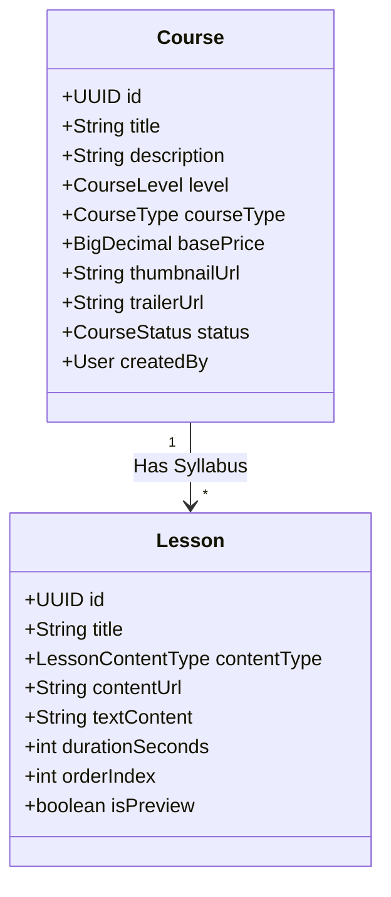

# 🎨 DESIGN: Course Detail Page for Guests (US-G02)

Ngày tạo: 2026-06-03
Dựa trên: [userstory.md](file:///Users/haison/Documents/GitHub/english-learning-web/userstory.md) - US-G02

---

## 1. Cách Lưu Thông Tin (Database)

Dữ liệu chi tiết khóa học được liên kết từ 2 bảng chính:



---

## 2. Thiết Kế API Endpoints (Backend API)

Bổ sung API lấy chi tiết khóa học và danh sách bài học đi kèm mà **không yêu cầu đăng nhập (Public access)**.

### API 1: Lấy chi tiết khóa học (kèm Syllabus)
*   **Method:** `GET`
*   **Path:** `/api/v1/courses/{id}`
*   **Request Headers:** Không yêu cầu (Public)
*   **Response Body (CourseDetailDTO):**
    ```json
    {
      "id": "aaaa0001-0000-0000-0000-000000000000",
      "title": "Python Cơ Bản Cho Người Mới Bắt Đầu",
      "description": "Khóa học Python toàn diện dành cho...",
      "level": "BEGINNER",
      "courseType": "FREE",
      "basePrice": 0,
      "thumbnailUrl": "https://cdn.elearning.vn/thumbs/python-basic.jpg",
      "trailerUrl": "https://cdn.elearning.vn/trailers/python-basic-trailer.mp4",
      "status": "PUBLISHED",
      "createdById": "11111111-0000-0000-0000-000000000001",
      "createdByName": "Nguyễn Văn Admin",
      "createdAt": "2026-06-03T03:42:16",
      "updatedAt": "2026-06-03T03:42:16",
      "lessons": [
        {
          "id": "bbbb0101-0000-0000-0000-000000000000",
          "courseId": "aaaa0001-0000-0000-0000-000000000000",
          "title": "Bài 1: Giới Thiệu Python & Cài Đặt Môi Trường",
          "contentType": "VIDEO",
          "contentUrl": "https://cdn.elearning.vn/videos/python/01-intro.mp4",
          "textContent": null,
          "durationSeconds": 900,
          "orderIndex": 1,
          "isPreview": true
        }
      ]
    }
    ```

---

## 3. Luồng Hoạt Động (User Journey)

### 📍 HÀNH TRÌNH 1: Khách xem thông tin khóa học
1. **Khách** truy cập trang chủ, cuộn tới phần **Hệ thống Khóa học Nổi bật**.
2. **Khách** bấm vào nút mũi tên (Xem chi tiết) trên Card khóa học.
3. Giao diện chuyển đổi sang **Course Detail Page** (sử dụng State `currentView = 'course-detail'`).
4. Hệ thống hiển thị:
    *   Thông tin khóa học: Tiêu đề, mô tả, mức độ, học phí, tên giáo viên (`createdByName`).
    *   Trình phát video giới thiệu (`trailerUrl`) - Phát trực tiếp không cần đăng nhập.
    *   Chương trình học (Syllabus): Danh sách bài học được sắp xếp theo thứ tự `orderIndex`.
5. **Khách** có thể bấm nút **Quay lại** để quay lại trang chủ.

### 📍 HÀNH TRÌNH 2: Khách quyết định đăng ký học
1. Trên **Course Detail Page**, **Khách** bấm vào nút **Đăng ký học**.
2. Hệ thống kiểm tra trạng thái đăng nhập:
    *   Vì chưa đăng nhập → Hệ thống mở **AuthModal** (chọn mặc định tab Đăng ký/Đăng nhập) ngay trên màn hình.
3. Sau khi khách đăng nhập/đăng ký thành công → Hệ thống tự động chuyển sang giao diện học tập Dashboard và mở khóa học (nếu miễn phí) hoặc điều hướng đến thanh toán.

---

## 4. Checklist Kiểm Tra (Acceptance Criteria)

### Tính năng: Trang chi tiết khóa học cho khách
SPECS Reference: userstory.md - US-G02

- [ ] Hiển thị đầy đủ thông tin khóa học: Tên, mô tả, cấp độ học, học phí (Miễn phí / Số tiền VNĐ).
- [ ] Hiển thị thông tin giảng viên dạy khóa học (`createdByName`).
- [ ] Hiển thị tổng số bài học và tổng thời lượng khóa học.
- [ ] Hiển thị danh sách syllabus (tất cả các bài học) được sắp xếp đúng thứ tự.
- [ ] Cho phép phát thử video giới thiệu (trailer) của khóa học trực tiếp trên trang mà không cần đăng nhập.
- [ ] Nút "Đăng ký học" hoạt động:
    *   Nếu là Khách: Mở Modal Đăng nhập/Đăng ký.
    *   Nếu đã Đăng nhập: Hiển thị trạng thái đăng ký hoặc chuyển tới khu vực học tập.
- [ ] Có nút "Quay lại" trang chủ hoạt động mượt mà.

---

## 5. Kịch Bản Kiểm Thử (Test Cases)

### TC-01: Happy Path - Khách xem chi tiết khóa học
*   **Given:** Khách chưa đăng nhập, đang ở trang chủ.
*   **When:** Bấm nút "Xem chi tiết" khóa học "Python Cơ Bản".
*   **Then:**
    *   ✓ Giao diện chuyển sang trang chi tiết khóa học thành công.
    *   ✓ API `/api/v1/courses/{id}` được gọi và hiển thị đúng thông tin khóa học Python.
    *   ✓ Hiển thị syllabus gồm 4 bài học theo đúng thứ tự.
    *   ✓ Tên giáo viên "Nguyễn Văn Admin" được hiển thị rõ ràng.

### TC-02: Phát thử video Trailer không cần đăng nhập
*   **Given:** Khách đang ở trang chi tiết khóa học "Python Cơ Bản".
*   **When:** Nhấp vào trình phát video trailer.
*   **Then:**
    *   ✓ Video phát mượt mà không yêu cầu tài khoản hay Token.

### TC-03: Khách bấm "Đăng ký học"
*   **Given:** Khách đang ở trang chi tiết khóa học.
*   **When:** Bấm nút "Đăng ký học".
*   **Then:**
    *   ✓ Hộp thoại Đăng nhập/Đăng ký (AuthModal) mở lên giữa màn hình.

---

*Tạo bởi AWF 4.0 - Solution Design Phase*
